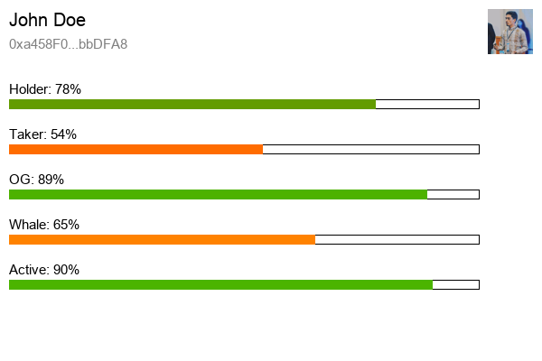

# NFT Resume

This project was presented as our BS Final Year Project which proposes a new solution to the problem of whitelisting. 

User enters a web3 wallet address and it returns a graphical view of the wallet owner behaviour on-chain. It tracks last 100 transactions of the wallet owner and predicts all five traits of the user if he/she is a Holder, Taker, Whale, OG and Active. This way, NFT Companies can understand their target audience and predict the success of their NFT launch by choosing the appropriate candidates.

## Example NFT Resume


## Installation
To run this project, you need to follow step by step

```bash
pip install -r requirements.txt
```

Create a .env file and add the following data

```python
MORALIS_API_KEY = YOUR_KEY
PRIVATE_KEY = YOUR_WEB3_WALLET_PRIVATE_KEY
IPFS_ID = YOUR_IPFS_ID
IPFS_SECRET = YOUR_IPFS_SECRET
```

Then run the following command
```bash
streamlit run run_app.py
```

You should be able to interact with a Streamlit frontend in your browser.